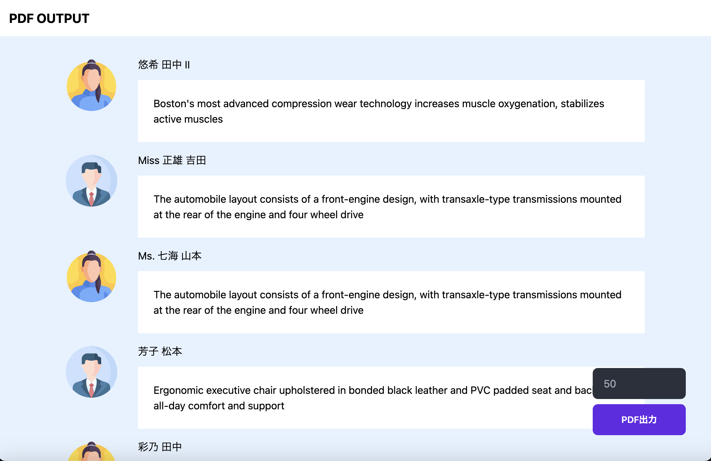

# PDF-OUTPUT

This application converts dynamic pages to PDF.
Change the number of users and actually run it.



## Developing

Once you've created a project and installed dependencies with `bun install` (or `pnpm install` or `npm install` or `yarn`), start a development server:

```bash
bun run dev

# or start the server and open the app in a new browser tab
bun run dev -- --open
```
